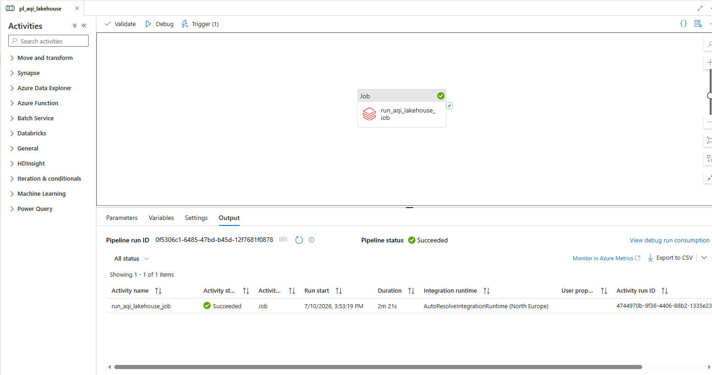
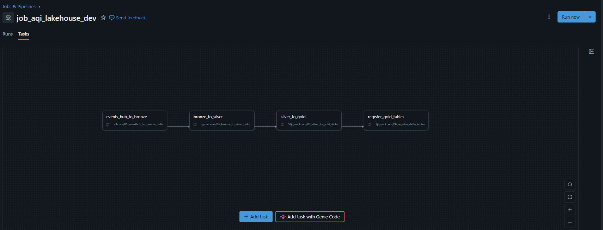
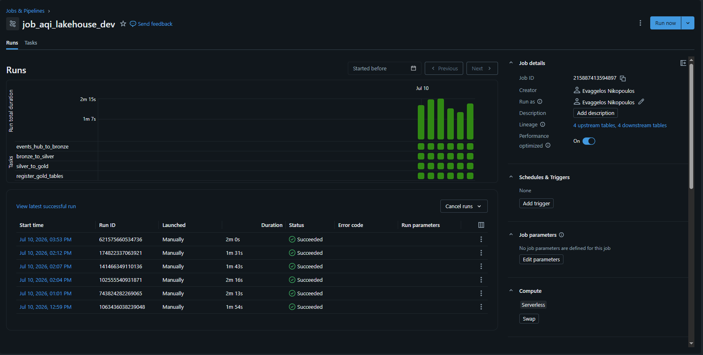
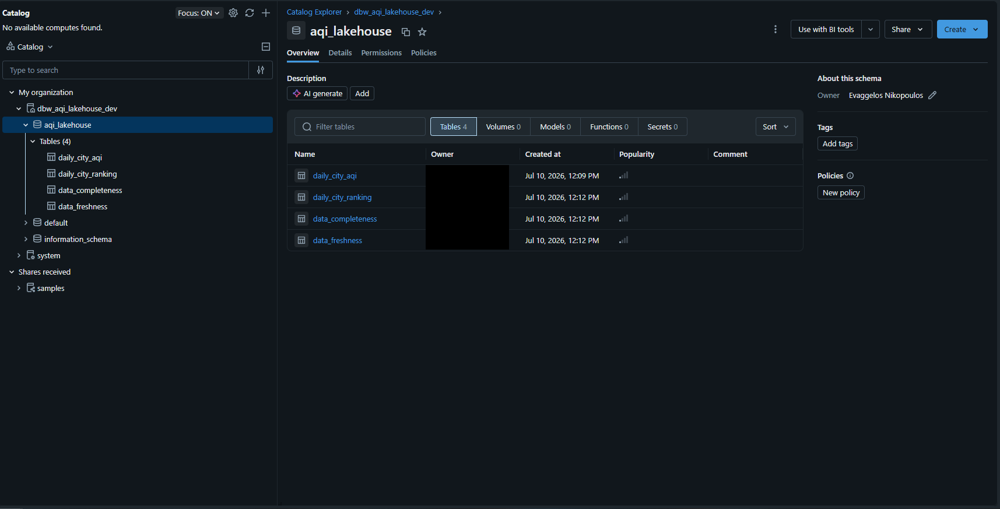

# Real-Time AQI Lakehouse Pipeline with Kafka, Spark, Azure Databricks and ADF

## Project Overview

This project implements an end-to-end air-quality lakehouse pipeline in both local and Azure environments.

Air-quality data is collected from the Open-Meteo API and published through a Kafka-compatible streaming layer. Apache Spark Structured Streaming processes the incoming records and writes them through Bronze, Silver, and Gold lakehouse layers.

The local implementation uses Apache Kafka, PySpark, Parquet, Docker, and the local filesystem. The Azure implementation uses Azure Event Hubs, Azure Databricks Serverless, Delta Lake, ADLS Gen2, Unity Catalog, Databricks Secrets, and Azure Data Factory.

Azure Data Factory orchestrates a Databricks Workflow containing four dependent tasks:

1. Event Hubs to Bronze Delta
2. Bronze to Silver Delta
3. Silver to Gold Delta
4. Gold Delta table registration in Unity Catalog

The project demonstrates API ingestion, event streaming, Spark Structured Streaming, Delta Lake, medallion architecture, data validation, deduplication, cloud storage, catalog governance, workflow orchestration, and analytics-ready Gold tables.


## Local Architecture

```text
Open-Meteo Air Quality API
        ↓
Python Producer
        ↓
Kafka Topic: air_quality_raw
        ↓
Spark Structured Streaming
        ↓
Bronze Layer: raw parsed AQI records
        ↓
Silver Layer: cleaned, validated, deduplicated AQI records
        ↓
Gold Layer: analytics-ready reporting tables
```

## Tech Stack

| Area | Tools |
|---|---|
| Language | Python |
| Streaming broker | Apache Kafka, Azure Event Hubs |
| Stream processing | Spark Structured Streaming, PySpark |
| Cloud processing | Azure Databricks Serverless |
| Storage formats | Parquet, Delta Lake |
| Storage | Local filesystem, ADLS Gen2 |
| Orchestration | Azure Data Factory, Databricks Workflows |
| Governance | Unity Catalog external locations |
| Catalog / SQL access | Unity Catalog, Spark SQL |
| Secrets management | Databricks Secrets |
| Local runtime | WSL, Docker, Docker Compose |
| Version control | Git, GitHub |

## Pipeline Layers

### Producer

The producer fetches air-quality data from the Open-Meteo API and publishes each AQI event as a JSON message to Kafka.

Kafka topic:

```text
air_quality_raw
```

Each event contains source, city metadata, measurement timestamp, AQI and pollutant values, and ingestion timestamp.

### Bronze Layer

The Bronze layer reads JSON messages from Kafka using Spark Structured Streaming.

Purpose:

- read from Kafka
- cast Kafka binary value to string
- parse JSON into structured columns
- write raw parsed records to Parquet

Output:

```text
data/bronze/air_quality_raw/
```

Checkpoint:

```text
data/checkpoints/bronze_air_quality_raw/
```

### Silver Layer

The Silver layer cleans and validates Bronze data.

Transformations:

- cast timestamp strings to timestamp type
- filter malformed/non-Open-Meteo records
- add validation flags
- remove invalid pollutant/AQI records
- remove future forecast records
- deduplicate by city and measurement timestamp
- keep latest ingestion timestamp when duplicates exist

Output:

```text
data/silver/air_quality/
```

### Gold Layer

The Gold layer creates analytics-ready tables for reporting.

Outputs:

```text
data/gold/daily_city_aqi/
data/gold/daily_city_ranking/
data/gold/data_freshness/
data/gold/data_completeness/
```

Gold tables:

| Table | Purpose |
|---|---|
| daily_city_aqi | Daily AQI and pollutant metrics by city |
| daily_city_ranking | Worst daily average AQI recorded for each city |
| data_freshness | Latest ingestion timestamp per city |
| data_completeness | Actual vs expected record counts per city/date |

## How to Run Locally

### 1. Create and activate virtual environment

```bash
python3 -m venv .venv
source .venv/bin/activate
pip install -r requirements.txt
```

### 2. Start Kafka

```bash
docker compose -f kafka/docker-compose.yml up -d
```

### 3. Create Kafka topic

```bash
docker exec -it local-kafka /opt/kafka/bin/kafka-topics.sh \
  --create \
  --topic air_quality_raw \
  --bootstrap-server localhost:9092
```

If the topic already exists, continue.

### 4. Run the API producer

```bash
python -m producer.produce_openmeteo_to_kafka
```

### 5. Run Kafka to Bronze streaming job

```bash
spark-submit \
  --packages org.apache.spark:spark-sql-kafka-0-10_2.13:4.1.2 \
  spark/kafka_to_bronze.py
```

Stop the streaming job with:

```text
CTRL + C
```

### 6. Run Bronze to Silver job

```bash
python spark/bronze_to_silver.py
```

### 7. Run Silver to Gold job

```bash
python spark/silver_to_gold.py
```

### 8. Stop Kafka

```bash
docker compose -f kafka/docker-compose.yml down
```

## Data Quality Checks

The Silver layer adds validation flags for:

- valid European AQI
- valid PM10
- valid PM2.5
- valid nitrogen dioxide
- non-future measurement timestamps

Deduplication keeps one record per:

```text
city_id + measurement_timestamp
```

When duplicates exist, the record with the latest `ingestion_timestamp_utc` is kept.

## Current Status

### Completed

* Open-Meteo API ingestion
* Local Kafka producer and topic
* Kafka-compatible Azure Event Hubs producer
* Spark Structured Streaming ingestion
* Local Bronze, Silver, and Gold Parquet layers
* Azure Bronze, Silver, and Gold Delta Lake layers
* Silver validation and deduplication rules
* Gold analytics tables
* ADLS Gen2 lakehouse storage
* Databricks Serverless notebook execution
* Databricks Secrets for Event Hubs credentials
* Unity Catalog external location
* Gold Delta table registration in Unity Catalog
* Four-task Databricks Workflow
* Azure Data Factory Databricks Job activity
* ADF scheduled trigger
* Successful end-to-end ADF pipeline runs

### Planned Enhancements

* Power BI dashboard using the registered Gold tables
* Automated data-quality tests
* Infrastructure as Code
* CI/CD deployment for Azure resources

### Cost Management

The Azure implementation was validated successfully before the Azure free trial ended. The ADF trigger was disabled after testing to prevent additional scheduled executions and unnecessary cloud costs.

## Azure Migration

The project was migrated from a local Kafka/Spark/Parquet pipeline to an Azure lakehouse-style architecture using Event Hubs, Databricks Serverless, Unity Catalog external locations, and ADLS Gen2.

### Azure Architecture
```text
Open-Meteo Air Quality API
        ↓
Python Producer
        ↓
Azure Event Hubs
        ↓
Azure Data Factory Schedule Trigger
        ↓
ADF Databricks Job Activity
        ↓
Azure Databricks Workflow
        ↓
Event Hubs → Bronze Delta
        ↓
Bronze Delta → Silver Delta
        ↓
Silver Delta → Gold Delta
        ↓
Register Gold tables in Unity Catalog
        ↓
ADLS Gen2 + Unity Catalog Gold Tables
```

### Azure Components
| Component                       | Purpose                                  |
| ------------------------------- | ---------------------------------------- |
| Azure Event Hubs                | Kafka-compatible streaming ingestion     |
| Azure Databricks Serverless     | Spark processing and notebook execution  |
| ADLS Gen2                       | Cloud lakehouse storage                  |
| Unity Catalog External Location | Governed access to ADLS paths            |
| Databricks Secrets              | Secure storage of Event Hubs credentials |
| Azure Data Factory | Scheduling and orchestration of the Databricks Workflow |

### Azure Data Factory Orchestration

Azure Data Factory is used as the orchestration layer for the Azure implementation.

ADF does not perform the Spark transformations directly. Instead, it triggers an existing Azure Databricks Workflow through a Databricks Job activity.

ADF configuration:

| Resource             | Name / Purpose          |
| -------------------- | ----------------------- |
| Pipeline             | `pl_aqi_lakehouse`      |
| Activity             | `run_aqi_lakehouse_job` |
| Activity type        | Databricks Job          |
| Databricks compute   | Serverless              |
| Trigger              | Hourly schedule trigger |
| Pipeline concurrency | One active pipeline run |

The Databricks Workflow contains four dependent notebook tasks:

```text
Event Hubs to Bronze
        ↓
Bronze to Silver
        ↓
Silver to Gold
        ↓
Register Gold tables
```

Each task starts only after the previous task succeeds. This allows ADF to control scheduling and monitoring while Databricks handles Spark execution and task dependencies.

The pipeline and Databricks Workflow were tested successfully through multiple end-to-end ADF debug runs.

The ADF trigger was disabled after validation to prevent unnecessary Azure costs after the free trial ended.

### Pipeline Execution

The complete Azure pipeline was tested successfully through Azure Data Factory.

The ADF schedule trigger started the Databricks Job activity, which triggered the existing four-task Databricks Workflow. Each notebook task started only after the previous task completed successfully.

#### Successful Azure Data Factory Trigger Run

The following screenshot combines the ADF pipeline canvas with a successful triggered pipeline run.



#### Databricks Workflow Graph

The Databricks Workflow defines the execution order of the four notebook tasks.



#### Successful Databricks Workflow Run

All four Databricks notebook tasks completed successfully using Serverless compute.



#### Unity Catalog Gold Tables

The Gold Delta outputs were registered as external tables in the `dbw_aqi_lakehouse_dev.aqi_lakehouse` Unity Catalog schema.



### Completed Azure Migration Steps
- Published Open-Meteo AQI records to Azure Event Hubs using the Kafka-compatible endpoint.
- Configured Databricks secrets for Event Hubs credentials.
- Created an ADLS Gen2 lakehouse container with Bronze, Silver, Gold, and checkpoint folders.
- Configured Databricks access to ADLS using an Access Connector and Unity Catalog external location.
- Read Event Hubs messages from Databricks.
- Wrote raw JSON messages to the Bronze layer.
- Parsed Bronze JSON into structured records.
- Created Silver cleaned, validated, and deduplicated AQI records.
- Created Gold analytics tables for reporting.
- Registered the Gold Delta outputs as external Unity Catalog tables.
- Created a four-task Databricks Workflow using Serverless compute.
- Configured task dependencies from Event Hubs ingestion through Gold table registration.
- Created an Azure Data Factory pipeline using a Databricks Job activity.
- Connected ADF to the existing Databricks Workflow.
- Added and tested an hourly ADF schedule trigger.
- Validated multiple successful end-to-end ADF pipeline runs.
- Disabled the ADF trigger after testing to control Azure costs.

### Azure Data Lake Layout
```text
lakehouse/
├── bronze/
│   ├── air_quality_raw/
│   └── air_quality_structured/
├── silver/
│   └── air_quality/
├── gold/
│   ├── daily_city_aqi/
│   ├── daily_city_ranking/
│   ├── data_freshness/
│   └── data_completeness/
└── checkpoints/
```

### Delta Lake Upgrade

The Azure version was upgraded from Parquet outputs to Delta Lake tables for the Bronze, Silver, and Gold layers.

Delta outputs:

```text
lakehouse/
├── bronze_delta/
│   ├── air_quality_raw/
│   └── air_quality_structured/
├── silver_delta/
│   └── air_quality/
├── gold_delta/
│   ├── daily_city_aqi/
│   ├── daily_city_ranking/
│   ├── data_freshness/
│   └── data_completeness/
└── checkpoints_delta/
```
### Databricks Gold Table Registration

The Gold Delta outputs were registered as external Delta tables in Unity Catalog, making the analytics layer queryable through Databricks SQL and Spark SQL.

Registered catalog and schema:

```text
Catalog: dbw_aqi_lakehouse_dev
Schema: aqi_lakehouse
```

Registered Gold tables:

| Table                | Description                                         |
| -------------------- | --------------------------------------------------- |
| `daily_city_aqi`     | Daily AQI and pollutant metrics by city             |
| `daily_city_ranking` | Worst daily average European AQI recorded for each city |
| `data_freshness`     | Latest ingestion and measurement timestamps by city |
| `data_completeness`  | Actual vs expected daily record counts by city      |

This step registers table metadata over existing ADLS Gen2 Delta paths. The data remains stored in ADLS Gen2, while Databricks provides a table interface for querying and downstream BI/reporting.

Example query:

```sql
SELECT *
FROM dbw_aqi_lakehouse_dev.aqi_lakehouse.daily_city_aqi
ORDER BY measurement_date, city;
```
### Sample Gold Outputs

The following outputs were produced from the Gold Delta tables after a successful end-to-end pipeline execution.

#### Worst Daily AQI Recorded per City

This output returns the worst daily average European AQI recorded for each city.

The ranking is calculated separately within each city's available history. Only rows where `rank = 1` are returned, so every displayed city has a rank of `1`.

```text
+----------------+------------+----------------+----+
|measurement_date|city        |avg_european_aqi|rank|
+----------------+------------+----------------+----+
|2026-07-09      |Paris       |29.0            |1   |
|2026-07-09      |Berlin      |23.23           |1   |
|2026-07-09      |Athens      |39.36           |1   |
|2026-07-09      |London      |35.95           |1   |
|2026-07-09      |Thessaloniki|37.82           |1   |
+----------------+------------+----------------+----+
```

#### Data Freshness Check

This output shows the latest ingestion and measurement timestamps available for each city.

```text
+------------+------------------------------+----------------------------+
|city        |latest_ingestion_timestamp_utc|latest_measurement_timestamp|
+------------+------------------------------+----------------------------+
|Athens      |2026-07-09 20:58:21.635676    |2026-07-09 21:00:00         |
|Berlin      |2026-07-09 20:58:23.578567    |2026-07-09 21:00:00         |
|London      |2026-07-09 20:58:22.555047    |2026-07-09 21:00:00         |
|Paris       |2026-07-09 20:58:23.066659    |2026-07-09 21:00:00         |
|Thessaloniki|2026-07-09 20:58:22.148159    |2026-07-09 21:00:00         |
+------------+------------------------------+----------------------------+
```

#### Data Completeness Check

This output compares the number of available hourly measurements with the expected 24 records per city and measurement date.

The result shows that 22 of the expected 24 hourly records were available for each city at the time of execution, producing a completeness rate of `91.67%`. Because the pipeline ran before the end of the measurement day, this result may represent an in-progress day rather than missing data.

```text
+------------+----------------+--------------+----------------+----------------+
|city        |measurement_date|actual_records|expected_records|completeness_pct|
+------------+----------------+--------------+----------------+----------------+
|Athens      |2026-07-09      |22            |24              |91.67           |
|Berlin      |2026-07-09      |22            |24              |91.67           |
|London      |2026-07-09      |22            |24              |91.67           |
|Paris       |2026-07-09      |22            |24              |91.67           |
|Thessaloniki|2026-07-09      |22            |24              |91.67           |
+------------+----------------+--------------+----------------+----------------+
```
## Security and Configuration

Credentials and sensitive connection details are not committed to the repository. Selected non-sensitive resource names are retained for documentation, while exported configuration files use placeholders for credentials and deployment-specific identifiers.

The following credentials and deployment-specific values must be configured separately:

- Databricks personal access token or managed identity
- Event Hubs connection string
- Databricks secret scope values
- Azure storage credentials
- Databricks workspace domain
- Databricks Job ID
- ADF encrypted credentials

Exported Azure Data Factory configuration files use placeholders where environment-specific or sensitive values are required.

## Notes

Generated pipeline outputs are ignored by Git:

```text
data/bronze/
data/silver/
data/gold/
data/checkpoints/
```

Only small sample data may be committed under:

```text
data/samples/
```